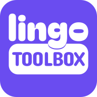
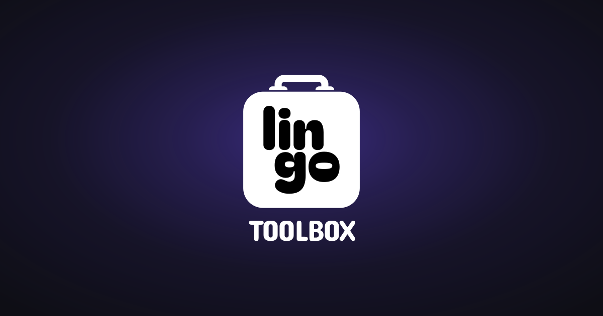

<div align="center">



# Lingo Toolbox

**Practise the words you nearly know.**

A set of language-learning tools that runs entirely in your browser — not a course. Pick a language workspace and work on the words you've already met somewhere else: a deck you're mid-way through, a rule you keep looking up, a verb that never sticks.

[**Open the app →**](https://vgomx.github.io/lingotoolbox/)

[](LICENSE)


[](https://github.com/vgomx/lingo-ds)



</div>

## Features

- **Four workspaces** — English, Brazilian Portuguese, Dutch and Spanish, each with its own decks, notes and schedule. Switching one changes the whole app and takes you home.
- **Flashcards on a real scheduler** — a local SM-2 implementation with four grades. The labels under the buttons show the actual interval each one buys you, worked out from the card in front of you rather than fixed copy.
- **Ask both ways** — turn a deck around and each direction keeps its own schedule, because recognising *brood* and producing it from "bread" are two different things you know to two different degrees. A triage step lets you pick which cards survive the reversal, since plenty of phrases only work in one direction.
- **Undo the last grade** — `Z`, ten deep, restoring the schedule exactly as it was rather than approximating it.
- **Grammar Notes** — short explanations tagged the way your cards are, so the rule about *de* or *het* turns up while you're reviewing a noun. `G` opens it mid-review without ending the session.
- **CEFR levels** — cards carry A1–C1, and the home screen breaks today's due count down by level.
- **Illustrations** — an OpenMoji glyph on a card, from a curated set of 526 vendored locally.
- **Backup and restore** — a single JSON file holding every deck, card, review and note across all four workspaces. Restoring adds what's missing and leaves what's there alone, so importing twice is harmless.
- **Installable** — add it to a home screen or dock and it runs in its own window, offline.
- **Light and dark**, a full keyboard path through review, and a dock built for a thumb on a phone.

Nothing you write leaves your device. There is no server, no account and no paid tier — your cards live in IndexedDB on your own machine, which is also why the backup file matters.

## Keyboard

| | |
|---|---|
| **Review** | `Space` / `Enter` turn the card · `1`–`4` grade it · `Z` undo the last grade · `G` the rule for this card |
| **Decks** | `N` add a card |
| **Anywhere** | `Esc` closes a dialog or a menu |

## Getting started

This app uses [`lingo-ds`](https://github.com/vgomx/lingo-ds), its design system, as a local `file:` dependency — so it expects `lingo-ds` checked out as a **sibling directory**:

```
some-folder/
├── lingotoolbox/   (this repo)
└── lingo-ds/
```

Built and tested on **Node 20**.

```sh
# 1. build the design system
git clone https://github.com/vgomx/lingo-ds
cd lingo-ds && npm install && npm run build

# 2. run the app
git clone https://github.com/vgomx/lingotoolbox
cd ../lingotoolbox && npm install && npm run dev
```

If `npm install` can't resolve `lingo-ds`, it's because `lingo-ds/dist` is missing — build the design system again.

### Scripts

| Command | Does |
|---|---|
| `npm run dev` | Start the Vite dev server with hot reload. |
| `npm run build` | Typecheck, check the illustrations, build to `dist/`, copy `index.html` to `404.html`. |
| `npm run preview` | Serve the production build locally. |
| `npm run typecheck` | `tsc -b --noEmit`. |
| `npm run check:illustrations` | Verify every referenced glyph exists. Runs on every build. |
| `npm run build:illustrations` | Re-download the OpenMoji set and regenerate the catalogue. |
| `npm run build:icons` | Regenerate the PWA icons from the design system's lockup. |
| `npm run build:social-card` | Regenerate the card at the top of this file. |

## Tech

- **[React 18](https://react.dev)** + **TypeScript** (strict), built with **[Vite](https://vite.dev)**.
- **[lingo-ds](https://github.com/vgomx/lingo-ds)** — the design system: tokens, components and sounds ([showcase](https://vgomx.github.io/lingo-ds/)).
- **[idb](https://github.com/jakearchibald/idb)** over IndexedDB for storage; no ORM and no server.
- **[vite-plugin-pwa](https://vite-pwa-org.netlify.app)** / Workbox for the service worker.
- **[OpenMoji](https://openmoji.org)** for card illustrations.

```
src/
├─ data/       IndexedDB access, the scheduler, starter decks and notes
├─ state/      the one store the app reads from
├─ shell/      rail, deck sidebar, top bar, dock, language picker
├─ tools/      Flashcards, Grammar Notes, and empty states for the other three
├─ marketing/  the light-theme landing page
└─ styles/     app-level CSS (everything visual comes from lingo-ds tokens)
```

There is no `src/assets/`. Brand artwork is imported from the package — `import mark from 'lingo-ds/assets/logo/mark-violet.svg'` — so the app can't drift by holding a stale copy. The favicon is the exception, since it has to be a real file at a fixed URL; `sync:assets` copies it into `public/` before `dev` and `build`, so it's generated rather than committed.

## How a few things work

**The scheduler.** `src/data/scheduler.ts` is SM-2 adapted to four grades. New cards step `1m · 6m · 1d · 4d`; after that intervals come from the card's ease factor. Reviews are fuzzed by ±5%, so cards introduced together stop arriving together forever. Grading writes the new state and the review-log entry in a single IndexedDB transaction, so a card can never advance unrecorded.

**Directions.** A card can be scheduled forwards, backwards, or both, and each direction carries its own interval, ease and due date. Turning a deck off doesn't discard the reverse schedule — it just stops asking, so a preference never behaves like a destructive action.

**Notes.** A note matches a card when their tags intersect. That's the whole mechanism; there's no per-card link to maintain, so tagging a new card correctly is what earns it the explanation.

**Illustrations.** A card stores the **codepoint** (`1F436`), never a filename, so a renamed file or a revised OpenMoji annotation can't orphan somebody's card. The 526 glyphs are curated in `scripts/openmoji-selection.mjs` — the entire `smileys-emotion` group plus ~360 concrete nouns. Expressions are taken whole because "annoyed" and "furious" are a vocabulary distinction eight faces can't draw. They're deliberately **not** precached: that would more than double a first visit to ship pictures most people never open the picker to see.

**Type.** The three faces are self-hosted WOFF2, generated by `lingo-ds`'s `build:fonts` script and precached, so the app is set in its own type from the first visit with no request to a third party. They are variable fonts asked for as weight *ranges* — `wght@400..800` returns one file covering every weight, where the discrete `400;500;600` spelling returns one file each and cost 528 KB for Nunito Sans alone.

The latin-ext cut of the two text faces is deliberately left out of the precache: the four workspaces are covered by latin, and `unicode-range` means a browser only fetches it if such a character appears. JetBrains Mono's latin-ext *is* precached — IPA lives in that range, so `/ˈlɛkər/` needs it on the first card with a pronunciation.

**Storage.** IndexedDB at version 2. Upgrades are guarded on `oldVersion`, so a database that predates a store keeps everything it already had. The backup format carries its own version and stays able to read older files.

## Known gaps

- **Three tools are empty.** Etymology Explorer, Conjugation Drill and Phrasebook are designed and routed but not built. They're marked SOON in the rail and sort below what works.
- **Deep links on Pages.** `dist/404.html` is a copy of `index.html` so the SPA boots; GitHub still returns a 404 *status* for those URLs, though the page renders.

## Contributing

Issues and pull requests are welcome. If you're planning something larger than a fix, opening an issue first is the quickest way to find out whether it fits.

Before opening a PR, please make sure `npm run build` passes — it runs the typecheck and the illustration check. The codebase leans on comments that explain *why* a piece of code is the way it is rather than what it does, usually because the obvious version was tried first and didn't work; matching that is the most useful style note.

## License

[MIT](LICENSE) © 2026 [Vitor Gomes](https://vitorgomes.design)

Icons are [Lucide](https://lucide.dev) (ISC; 22 of the 76 used are Feather-derived and additionally MIT, © Cole Bemis). Illustrations are [OpenMoji](https://openmoji.org) (CC BY-SA 4.0), used unmodified — 526 glyphs ship in `public/openmoji/`, so the attribution is a real obligation and is carried in `src/legalNotices.ts`. Typefaces are Baloo 2, Nunito Sans and JetBrains Mono (OFL 1.1), served from this origin as WOFF2 rather than fetched from Google — which is what makes the full licence a shipping obligation, carried in the same file.

Full notices for everything the app ships are in `src/legalNotices.ts` and surfaced in the app under **Settings → Legal**. Only things that actually reach the browser are listed — build tooling never ships, so it carries no obligation to end users.
